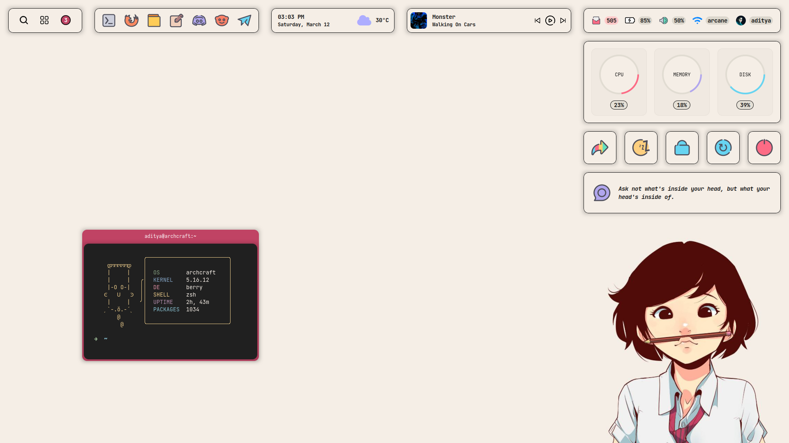

<!-- EWW Widgets -->

# Widgets

<p align="left">
  
  
  
  
</p>

<p align="left">Few widgets for <a href="https://github.com/elkowar/eww">EWW</a>, Elkowar’s Wacky Widgets.</p>

---

## Arin

<p align="center">
  
</p>

## Dashboard

<p align="center">
  
</p>

### Installation

- Install Elkowar’s Wacky Widgets - [Instructions](https://elkowar.github.io/eww/main)
- Clone this repository
```
$ git clone --depth=1 https://github.com/adi1090x/widgets.git
```
- Create eww config directory : **`~/.config/eww`**
- Copy everything from `eww` directory to **`~/.config/eww`**
- Install the required fonts from **`fonts`** directory

### Tips

- Put `eww` executable in your PATH (/bin, /usr/bin, etc).
- The `launch_dashboard` scripts works like a toggle, Perfect for key-bindings.
- You can use cron jobs to update weather and mail scripts.
- Get you own [weather key](https://openweathermap.org/api) from `openweathermap`, It's free.
- Edit `mails` script and add your credentials to get unread mails.

### FYI

- Don't use my black picture for your profile. 
- Music widget is for mpd/mpc, I don't use spotify, I don't care.
- Made for 1920x1080 displays only.
