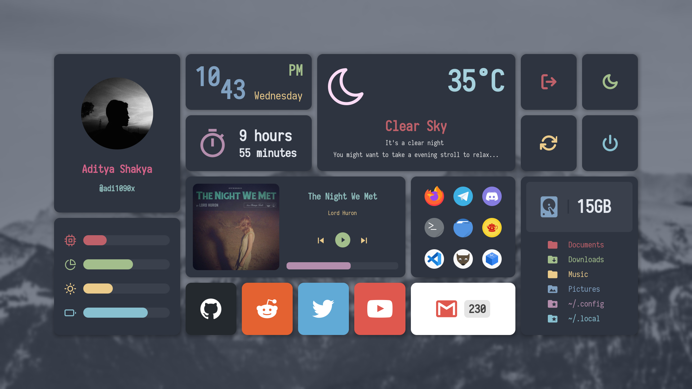

<!-- EWW Widgets -->

# Widgets

<p align="left">
  
  
  
  
</p>

<p align="left">Few widgets for <a href="https://github.com/elkowar/eww">EWW</a>, Elkowar’s Wacky Widgets.</p>

---

<p align="center">
  
</p>

**So, the xml config doesn't work anymore. I'll migrate these widgets to the new configuration 'YUCK' later.**

### Create a replica

- Install Elkowar’s Wacky Widgets - [Instructions](https://elkowar.github.io/eww/main)
- Create eww config directory : **`~/.config/eww`**
- Copy `eww` executable to **`$HOME/.bin`** (create directory if not exist)
- Clone this repository
```
$ git clone --depth=1 https://github.com/adi1090x/widgets.git
```
- Change to `widgets` directory and install required fonts from **`fonts`** directory
- Copy everything from `nordic` directory to eww's config directory : **`~/.config/eww`**
- Run eww daemon and execute `~/.config/eww/launch_eww`

### Tips

- Add **`$HOME/.bin`** to your PATH.
- The `launch_eww` scripts works like a toggle, Perfect for key-bindings.
- You can use cron jobs to update weather and mail scripts.
- Get you own [weather key](https://openweathermap.org/api) from `openweathermap`, It's free.
- Edit `mails` script and add your credentials to get unread mails.

### FYI

- Don't use my black picture for your profile. 
- Music widget is for mpd/mpc, I don't use spotify, I don't care.
- Made for 1920x1080 displays only.
- I'll make some more when i'm bored to death.
